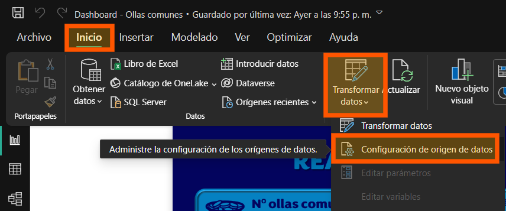
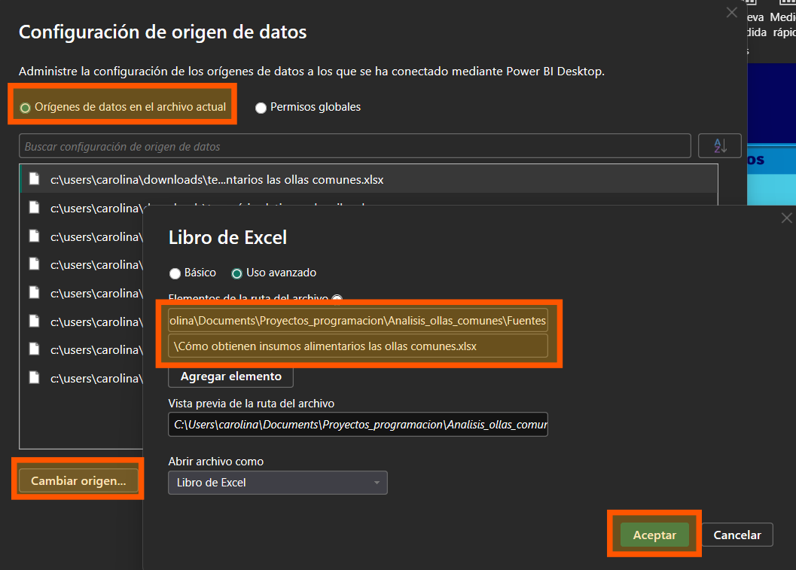
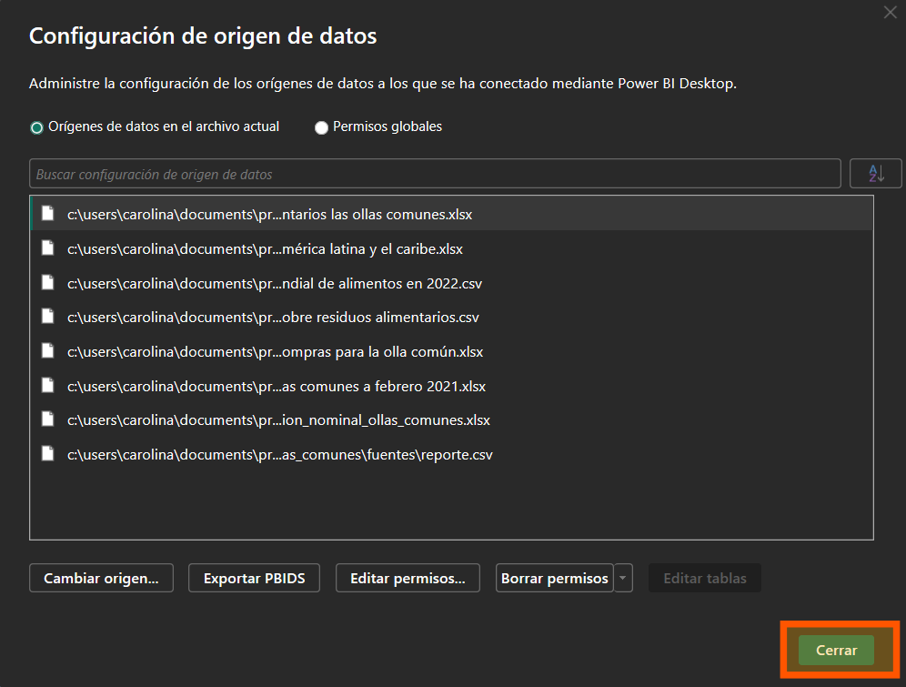
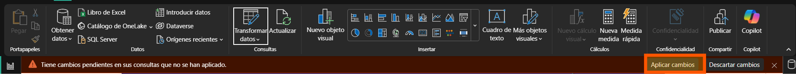

# *Análisis de la situación de las ollas comunes en Perú - UNMSM*


## 1. Descripción del proyecto
Este proyecto consiste en el análisis de la situación de las ollas comunes en Perú a partir de los datos que se encuentran en la web (fuentes confiables tanto nacionales como internacionales). En este repositorio encontrará los archivos relacionados a la generación del  dashboard, mas el detalle lo puede visualizar a través del siguiente [enlace](https://www.notion.so/2-Descripci-n-de-la-problem-tica-1d8d0fe6d6cb809eb832d9ce1286197b?pvs=4).

## 2. Estado del proyecto


## 3. Tecnologías utilizadas


## 4. Guía de instalación
1. Clonar el repositorio en su IDE:
    ```
    https://github.com/caroSeminario23/Analisis-padron-docentes-unmsm.git
    ```

2. Modificar la ruta de origen de las fuentes del dashboard:
    - **Paso 1**  
        

    - **Paso 2**: Modificar la primera parte de la ubicación por la ubicación del repositorio en su sistema de archivos local. Mantener la segunda sin modificación alguna.  
        

    - **Paso 3**  
        

    - **Paso 4**  
        

## 5. Contribuidores 
- Carolina Seminario (elaboró el dashboard)
- Alexis Hernandez (aportó fuentes)
- Aracely Rivera (aportó fuentes)
- Jamil Túncar (aportó fuentes)
- Leo Soto (aportó fuentes)

## 6. Licencia
[](./LICENSE)